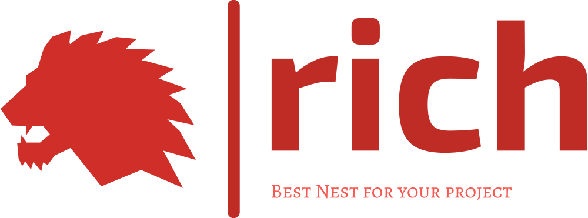

<a name="readme-top"></a>
*** Thanks for checking out the Rich. If you have a suggestion
*** that would make this better, please fork the repo and create a pull request
*** or simply open an issue with the tag "enhancement".
*** Don't forget to give the project a star!
*** Thanks again! Now go create something AMAZING! :D
-->


<!-- PROJECT SHIELDS -->
<!--
*** I'm using markdown "reference style" links for readability.
*** Reference links are enclosed in brackets [ ] instead of parentheses ( ).
*** See the bottom of this document for the declaration of the reference variables
*** for contributors-url, forks-url, etc. This is an optional, concise syntax you may use.
*** https://www.markdownguide.org/basic-syntax/#reference-style-links
-->
[![Contributors][contributors-shield]][contributors-url]
[![Forks][forks-shield]][forks-url]
[![Stargazers][stars-shield]][stars-url]
[![Issues][issues-shield]][issues-url]
[![MIT License][license-shield]][license-url]
[![LinkedIn][linkedin-shield]][linkedin-url]


<!-- PROJECT LOGO -->
<br />
<div align="center">
  <a href="https://github.com/ialiaslani/rich">
    
  </a>

<h3 align="center">Rich</h3>

  <p align="center">
    An awesome README template to jumpstart your projects!
    <br />
    <a href="https://github.com/ialiaslani/rich"><strong>Explore the docs »</strong></a>
    <br />
    <br />
    <a href="https://github.com/ialiaslani/rich">View Demo</a>
    ·
    <a href="https://github.com/ialiaslani/rich/issues">Report Bug</a>
    ·
    <a href="https://github.com/ialiaslani/rich/issues">Request Feature</a>
  </p>
</div>


<!-- TABLE OF CONTENTS -->
<details>
  <summary>Table of Contents</summary>
  <ol>
    <li>
      <a href="#about-the-project">About The Project</a>
      <ul>
        <li><a href="#built-with">Built With</a></li>
      </ul>
    </li>
    <li>
      <a href="#getting-started">Getting Started</a>
      <ul>
        <li><a href="#prerequisites">Prerequisites</a></li>
        <li><a href="#installation">Installation</a></li>
      </ul>
    </li>
    <li><a href="#usage">Usage</a></li>
    <li><a href="#roadmap">Roadmap</a></li>
    <li><a href="#contributing">Contributing</a></li>
    <li><a href="#license">License</a></li>
    <li><a href="#contact">Contact</a></li>
    <li><a href="#acknowledgments">Acknowledgments</a></li>
  </ol>
</details>


<!-- ABOUT THE PROJECT -->

## About The Project

[![Product Name Screen Shot][product-screenshot]](https://example.com)
Rich Is A Nestjs System Designed To Handle Needed Requirements In usual Projects Like:

1. permission
2. role
3. user
4. request log
5. crud

And A Lot More In Near Future!
<p align="right">(<a href="#readme-top">back to top</a>)</p>

### Built With

This section should list any major frameworks/libraries used to bootstrap your project. Leave any add-ons/plugins for
the acknowledgements section. Here are a few examples.

* [![Nest][Nest.js]][Nest-url]

[//]: # (* [![React][React.js]][React-url])

<p align="right">(<a href="#readme-top">back to top</a>)</p>


<!-- GETTING STARTED -->

## Getting Started

This is an example of how you may give instructions on setting up your project locally.
To get a local copy up and running follow these simple example steps.

### Prerequisites

You Need these dependencies:

1. node
2. yarn
3. redis
4. ts-node
5. git

### Installation

#### Clone the project

clone the project:

```sh
git clone https://github.com/ialiaslani/rich.git
```

<p align="right">(<a href="#readme-top">back to top</a>)</p>


<!-- USAGE EXAMPLES -->

## Usage

#### Rich Command Line:

You Can Add A New Crud In Your App With Handled Swagger, Permission, Crud, Dtos And etc Just With Using:
`yarn rich crud test` And Alos There Is A `-p` Flag If You Want Your Routes To Be Public!

#### Rich Crud

Rich Crud Suports Dynamic Query On Entity, Export Excel, Load Relations And Permissions Too!


<p align="right">(<a href="#readme-top">back to top</a>)</p>


<!-- ROADMAP -->

## Roadmap

- [x] currect the realtions in cruds
- [x] refactore services to use common service
- [x] role engine
- [x] add redis too login
- [x] add .env
- [x] add filter
- [x] add csv export
- [x] add dwonload avatar
- [x] add user status *DONE
- [x] validate permission (no match, wrong structure)
- [x] model generator (crud gnerator)
- [x] refolder
- [x] add excel too Crud Generator
- [ ] update role's permission
- [ ] notification
- [ ] socket (emqx) (for backup service)
- [ ] name the routes
- [ ] seed
- [ ] add ELASTIC
- [x] add linters
- [ ] separate configuration files
- [ ] add frontend (react+ant design)
- [ ] complete Docker
- [x] better readme
- [ ] add documentation (as wiki)

See the [open issues](https://github.com/ialiaslani/rich/issues) for a full list of proposed features (and known issues)
.

<p align="right">(<a href="#readme-top">back to top</a>)</p>


<!-- CONTRIBUTING -->

## Contributing

Contributions are what make the open source community such an amazing place to learn, inspire, and create. Any
contributions you make are **greatly appreciated**.

If you have a suggestion that would make this better, please fork the repo and create a pull request. You can also
simply open an issue with the tag "enhancement".
Don't forget to give the project a star! Thanks again!

1. Fork the Project
2. Create your Feature Branch (`git checkout -b feature/AmazingFeature`)
3. Commit your Changes (`git commit -m 'Add some AmazingFeature'`)
4. Push to the Branch (`git push origin feature/AmazingFeature`)
5. Open a Pull Request

<p align="right">(<a href="#readme-top">back to top</a>)</p>


<!-- LICENSE -->

## License

Distributed under the MIT License. See `LICENSE` for more information.

<p align="right">(<a href="#readme-top">back to top</a>)</p>


<!-- CONTACT -->

## Contact

[//]: # (Your Name - [@your_twitter]&#40;https://twitter.com/your_username&#41; - email@example.com)

[//]: # (Project Link: [https://github.com/your_username/repo_name]&#40;https://github.com/your_username/repo_name&#41;)

<p align="right">(<a href="#readme-top">back to top</a>)</p>


<!-- ACKNOWLEDGMENTS -->

## Acknowledgments

* [Choose an Open Source License](https://choosealicense.com)
* [Best README Template](https://github.com/othneildrew/Best-README-Template)

<p align="right">(<a href="#readme-top">back to top</a>)</p>


<!-- MARKDOWN LINKS & IMAGES -->
<!-- https://www.markdownguide.org/basic-syntax/#reference-style-links -->

[contributors-shield]: https://img.shields.io/github/contributors/ialiaslani/rich.svg?style=for-the-badge
[contributors-url]: https://github.com/ialiaslani/rich/graphs/contributors

[forks-shield]: https://img.shields.io/github/forks/ialiaslani/rich.svg?style=for-the-badge
[forks-url]: https://github.com/ialiaslani/rich/network/members

[stars-shield]: https://img.shields.io/github/stars/ialiaslani/rich.svg?style=for-the-badge
[stars-url]: https://github.com/ialiaslani/rich/stargazers

[issues-shield]: https://img.shields.io/github/issues/ialiaslani/rich.svg?style=for-the-badge
[issues-url]: https://github.com/ialiaslani/rich/issues

[license-shield]: https://img.shields.io/github/license/ialiaslani/rich.svg?style=for-the-badge
[license-url]: https://github.com/ialiaslani/rich/LICENSE

[linkedin-shield]: https://img.shields.io/badge/-LinkedIn-black.svg?style=for-the-badge&logo=linkedin&colorB=555
[linkedin-url]: https://linkedin.com/in/

[product-screenshot]: docs/assets/images/png/

[Nest.js]: https://img.shields.io/badge/nestjs-%23E0234E.svg?style=for-the-badge&logo=nestjs&logoColor=white
[Nest-url]: https://nestjs.com/

[React.js]: https://img.shields.io/badge/React-20232A?style=for-the-badge&logo=react&logoColor=61DAFB
[React-url]: https://reactjs.org/

